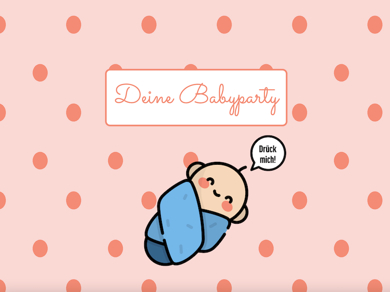
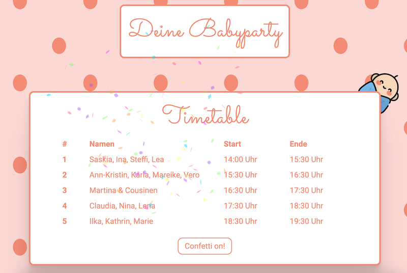

# Digital Party Timetable for Babypart

This was just a small fun project to build a simple invitation site for a (online) baby party with friends during the corona pandemic. With a lot of confetti served with javascript ;)

## Unclicked:

## Clicked:

Sources:
<a href="https://www.flaticon.com/free-icons/child" title="child icons">Child icons created by Freepik - Flaticon</a>
